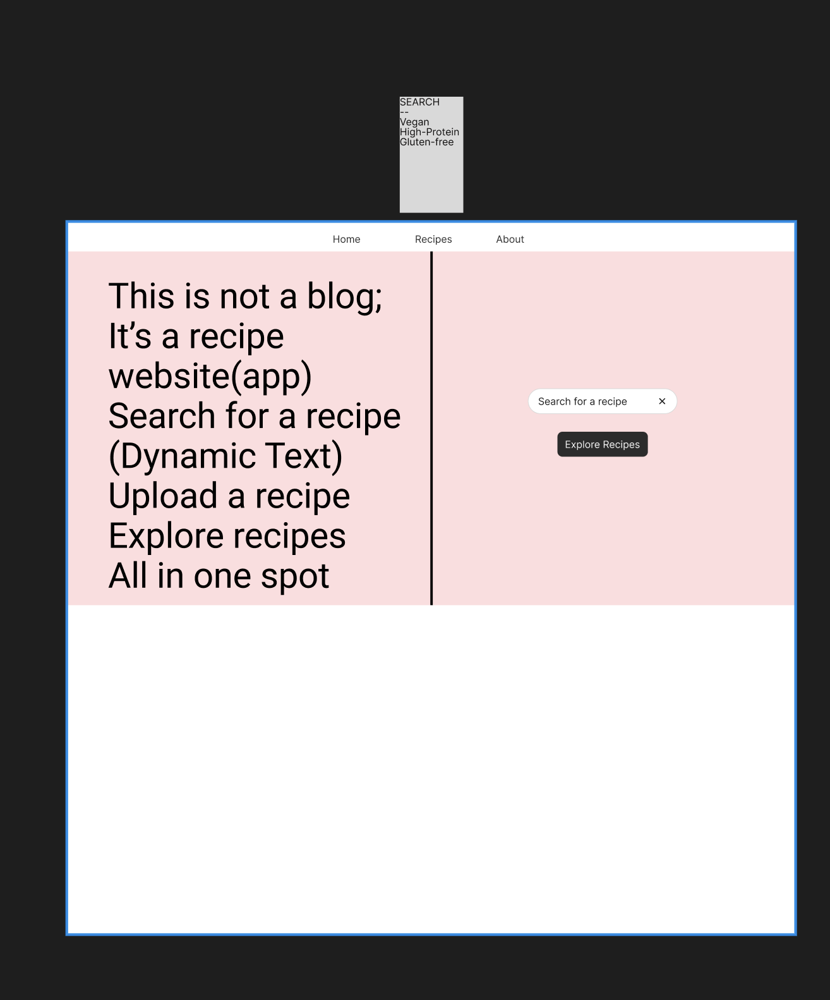
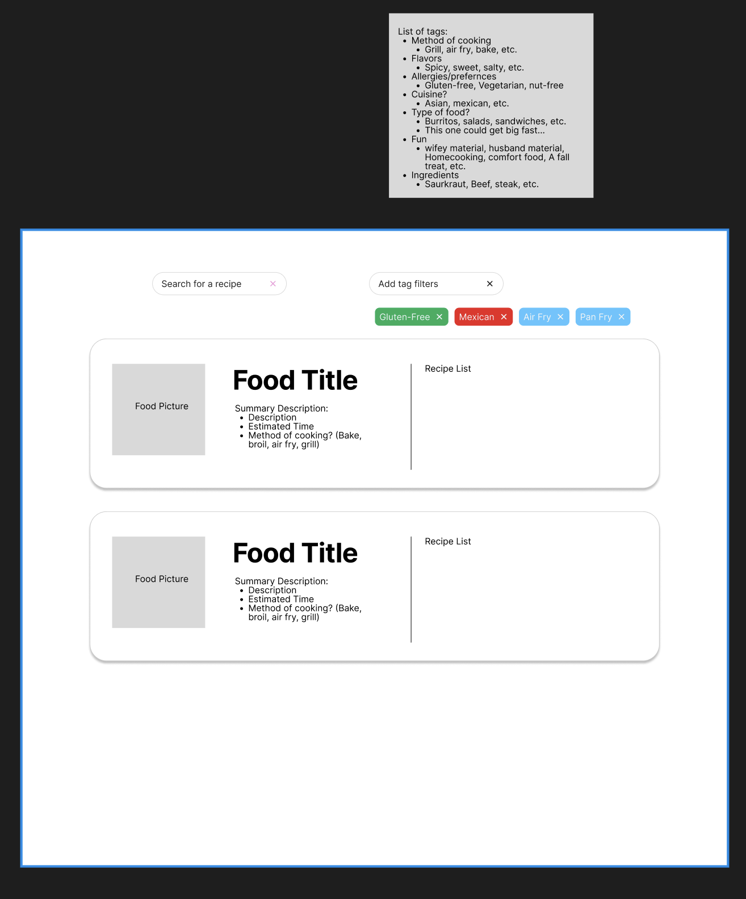
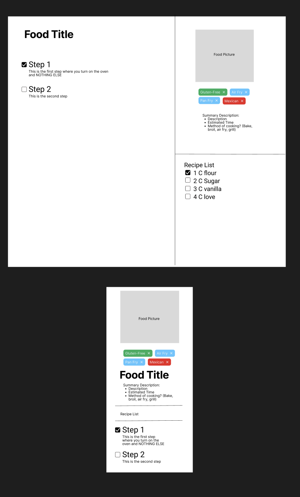
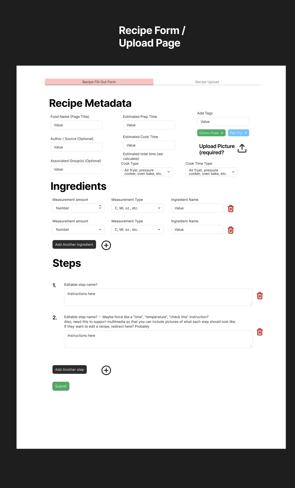
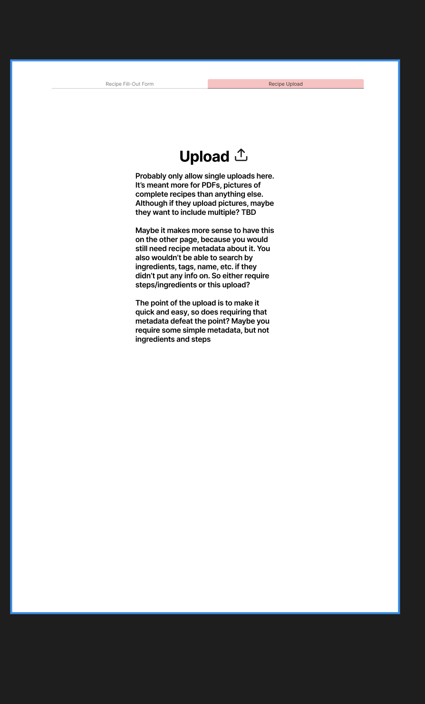

# Functional Specification for Family Recipes App

Owning author: Isaac Hamm

***DISCLAIMER: This specification is currently in progress.***

## Scenarios

**Scenario 1:** Matt the gourmet chef's crazy mother-in-law is constantly calling him about recipes that he made for her. Matt wants to make it so that he never has to talk with his mother-in-law about recipes again.

While complaining to his wife about this, she recommends that Matt the gourmet chef sign up for a FamilyRecipes account. Now, whenever Matt makes something for his mother-in-law, he adds the recipe to a folder ("MIL") inside of a recipe group that his mother-in-law is included in. He can point her to the recipe rather than trying to explain detailed instructions over the phone.

**Scenario 2:** Misty is a struggling college student. Her biggest concern is being able to impress college guys so that she can drop out and be a stay-at-home mom. In order to do that, she wants to learn to cook better, and so signs up for a FamilyRecipes account.

Misty is new to cooking, and so wants to be able to gather and try different recipes from a wide variety of places. She sets up a group with other college girls trying to impress boys, as well as one with her family so that she can get her brothers', mother's, and father's opinion on food. She wants to be able to add and keep track of a wide variety of recipes by adding them and adding her own notes to them. Pretty soon, though, she'll just hire a private chef on her husband's dime.

## Non Goals
For the initial version of the app, we will not worry about the following:

- Authentication security beyond a simple user password and group password (e.g., no 2FA, SSO, OAuth)
- Authorization (permissions) beyond the creator of the recipe/group being able to delete it and no one else.
- Allow users to assign ratings/reviews to recipes beyond basic notes/comments that follow the recipe
- Web-scraping recipes from websites, links, images, pdfs, anything.

## Overview

A basic user should be able to do the following in FamilyRecipes:
- Upload recipes to their own account as well as to groups of one or more accounts
- View recipes that they have uploaded or that others in their groups have uploaded
- Make comments on the recipes that they have permission to access
- ** **Open Issue** ** Should users be able to search an "Open for all" recipes database? Or only recipes in their groups?

## Screen by screen specification

### Home Screen

A welcome-to-the-website page.
** **Open issue** ** Should the initial page just *be* the search page?

### Recipe Search Screen

Functionality on this page:
- Upload new recipes
	- Can be PDFs
	- ** **Open issue** ** Should have a form that they can fill out manually to make a new recipe?
		- Maybe the solution is to have a form where you can upload a PDF as part of the form? Make either the PDF or parts of the form required
- Search for available recipes
	- Can search by tags (see figma for tag list)
	- ** **Open issue** ** Should we display the PDF inside of a viewer, or just offer the option to download?
	- ** **Open issue** ** Make deletion occur on this page? Or the recipe screen page? Or both?

### Recipe Screen

Functionality on this page:
- View existing chosen recipe
- Add comments to this recipe
	- Comments should be shared for all people in the group
- Add tags to this recipe
	- Tags should be part of the recipe, not the group
	- Can use tags to organize recipes into groups
	- E.g., gluten-free, vegetarian, high-protein, need-some-veggies, need-some-sugar, need-some-salt, etc.
- Checkboxes for steps to keep track of where you are
- ** **Open issue** ** Checkboxes for ingredients that you've used/not?
- ** **Open issue** ** Checkboxes for ingredients that you have/not?

### Recipe Upload Screen

Functionality on this page:
- Upload a new recipe in one of two ways: By filling out a form with relevant info, or uploading a .png or .pdf of a recipe (** **Open issue** ** Force PDF?)
	- For filling out a form, a user should add metadata, a variable-size list of ingredients, and a variable-size list of steps
	- For uploading a recipe, a user should add metadata, and be able to upload a pdf/image of the recipe
		- ** **Open issue** ** Should a user have to include ingredients for an upload as well, so that that is searchable? Or only if they want to?
		- The rationale here is that uploading an image/pdf should be very quick and easy, not bogged down with the time that it takes to fill out the form.
			- *Possible solution:* Make it so that others can fill out that data later, based on the PDF?

### About Screen

- Add contributors since this is a distributed project
	- Will Carden
	- Melissa Santos
	- Tanner Day
	- Jason Nouanounou